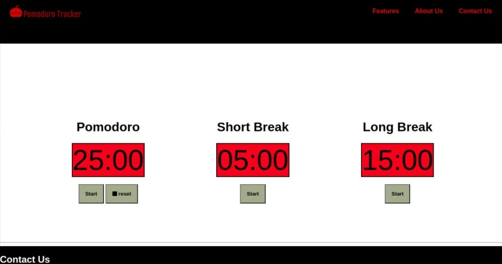

#  Pomodoro Technique Time

** Pomodoro Technique Time**  is a project which contains a timer of 25 minutes for work with  a short break of 5 min and long break of 15 min  and start and stop button and reset button to reset time and when times becomes zero an alarm plays for 10 seconds.
we have also added navigation with hamburger if width goes less than 767px than the icon will show or else we can see horizaontal navigation bar.

Content 

* **index.html**-this files contain basic markup with javascript and css file linked to it.
* **style.css**-this files contain all the style for clock watch navigation bar and footer.
* **main.js**-this is javascript file which contain all callback  of each function of pomodoro timer we have used modules and imported all function from other javascript files into it. and also hamburger icon processing is done in this file.

# DEMO 

